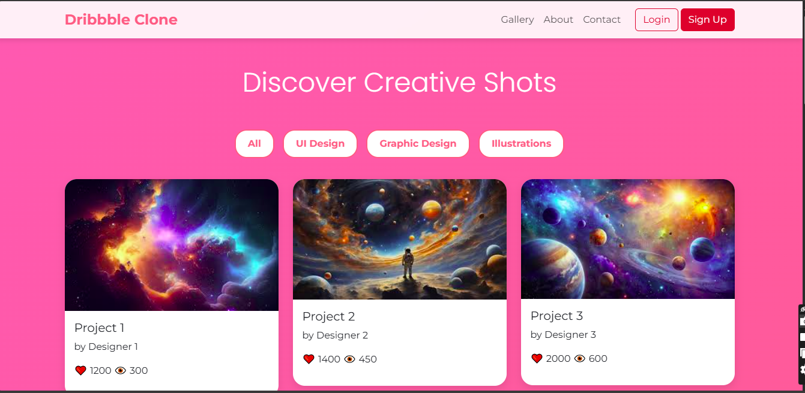
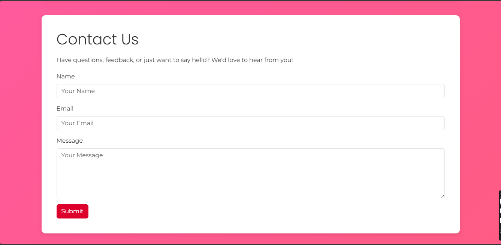
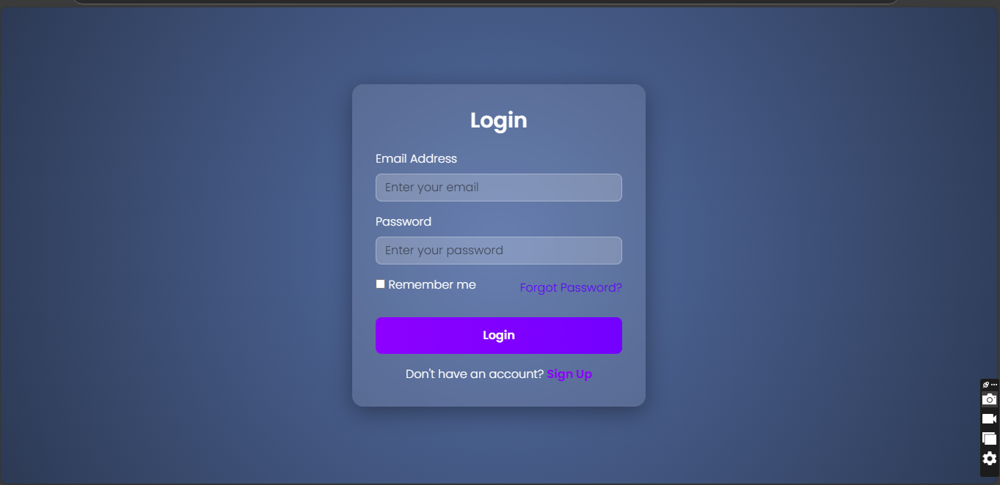
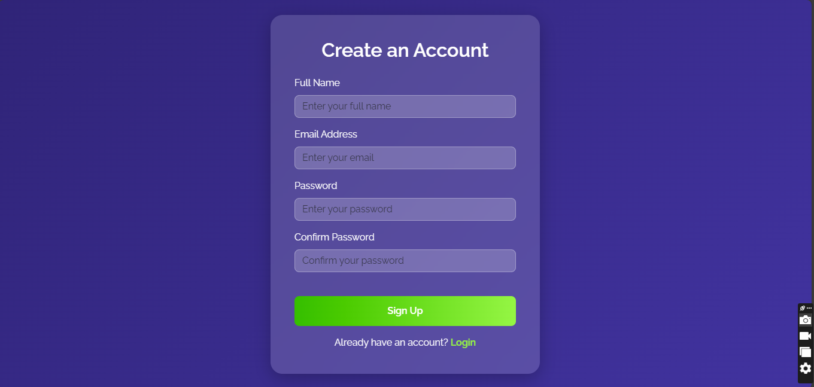

# Project Responsive Web Design using Bootstrap
# Date: 7/12/2024
# AIM:
To create a simplified clone of Dribbble (https://dribbble.com/) landing page.

# DESIGN STEPS:
## Step 1:
Clone the repository from GitHub.

## Step 2:
Create Django Admin project.

## Step 3:
Create a New App under the Django Admin project.

## Step 4:
Insert the necessary CSS and JavaScript files as external in order to use Bootstrap.

## Step 5:
Create a HTML file and include the needed Bootstrap components.

## Step 6:
Publish the website in the LocalHost.

# PROGRAM :

# HOME PAGE:
    <!DOCTYPE html>
    <html lang="en">
    <head>
        <meta charset="UTF-8">
        <meta name="viewport" content="width=device-width, initial-scale=1.0">
        <title>Dribbble Clone</title>
        <link href="https://cdn.jsdelivr.net/npm/bootstrap@5.3.0/dist/css/bootstrap.min.css" rel="stylesheet">
        <link href="https://fonts.googleapis.com/css2?family=Montserrat:wght@400;700&family=Poppins:wght@300;600&display=swap" rel="stylesheet">
        
    </head>
    <body>
        <!-- Navbar -->
        <nav class="navbar navbar-expand-lg">
            

                <a class="navbar-brand" href="#">Dribbble Clone</a>
                <button class="navbar-toggler" type="button" data-bs-toggle="collapse" data-bs-target="#navbarNav">
                    
                </button>
                

                    <ul class="navbar-nav ms-auto">
                        <li class="nav-item"><a class="nav-link" href="#gallery">Gallery</a></li>
                        <li class="nav-item"><a class="nav-link" href="#about">About</a></li>
                        <li class="nav-item"><a class="nav-link" href="#contact">Contact</a></li>
                    </ul>
                    

                        <a href="login.html" class="btn btn-outline-danger">Login</a>
                        <a href="signup.html" class="btn btn-danger">Sign Up</a>
                    

                

            

        </nav>

        <!-- Gallery Title -->
        
Discover Creative Shots

        <!-- Filter Bar -->
        

            <button class="btn">All</button>
            <button class="btn">UI Design</button>
            <button class="btn">Graphic Design</button>
            <button class="btn">Illustrations</button>
        

        <!-- Gallery Section -->
        

            

                <!-- Dynamically Generated Cards -->
            

        

        <!-- Lightbox Modal -->
        

            

                

                    

                        <button type="button" class="btn-close" data-bs-dismiss="modal" aria-label="Close"></button>
                        
                    

                    

                        <button class="btn btn-secondary" id="prevButton" onclick="navigateLightbox(-1)">Previous</button>
                        <button class="btn btn-secondary" id="nextButton" onclick="navigateLightbox(1)">Next</button>
                    

                

            

        

        <!-- Pagination -->
        <nav aria-label="Page navigation" class="mt-4">
            <ul class="pagination justify-content-center">
                <li class="page-item"><button class="page-link" id="prevGalleryPage" onclick="changePage(-1)" disabled>Previous</button></li>
                <li class="page-item"><button class="page-link" id="nextGalleryPage" onclick="changePage(1)">Next</button></li>
            </ul>
        </nav>

        <!-- About Section -->
        

            

                <h2>About Us</h2>
                
We are a creative hub for designers to share their artwork, inspire others, and connect with a global community. Explore, collaborate, and grow with us.

                
Our platform offers a seamless way to showcase your talent and receive valuable feedback from industry experts and fellow creatives. Whether you're a budding designer or a seasoned professional, you'll find a supportive environment here.

                
Beyond a gallery, we provide opportunities for learning through tutorials, challenges, and collaborations. Join us and be part of a vibrant, inspiring community that celebrates the beauty of design.

            

        

        <!-- Contact Section -->
        

            

                <h2>Contact Us</h2>
                
Have questions, feedback, or just want to say hello? We'd love to hear from you!

                <form>
                    

                        <label for="name" class="form-label">Name</label>
                        <input type="text" class="form-control" id="name" placeholder="Your Name">
                    

                    

                        <label for="email" class="form-label">Email</label>
                        <input type="email" class="form-control" id="email" placeholder="Your Email">
                    

                    

                        <label for="message" class="form-label">Message</label>
                        <textarea class="form-control" id="message" rows="5" placeholder="Your Message"></textarea>
                    

                    <button type="submit" class="btn btn-danger">Submit</button>
                </form>
            

        

        <!-- Footer -->
        <footer>
            
&copy; 2024 Dribbble Clone. Built with creativity and passion.

        </footer>

        <!-- Bootstrap JS -->
        

        
    </body>
    </html>

# LOGIN PAGE:
    <!DOCTYPE html>
    <html lang="en">
    <head>
        <meta charset="UTF-8">
        <meta name="viewport" content="width=device-width, initial-scale=1.0">
        <title>Login Page</title>
        <link href="https://cdn.jsdelivr.net/npm/bootstrap@5.3.0/dist/css/bootstrap.min.css" rel="stylesheet">
        <link href="https://fonts.googleapis.com/css2?family=Poppins:wght@300;600&display=swap" rel="stylesheet">
        
    </head>
    <body>
        

            <h2>Login</h2>
            <form>
                

                    <label for="email" class="form-label">Email Address</label>
                    <input type="email" id="email" class="form-control" placeholder="Enter your email" required>
                

                

                    <label for="password" class="form-label">Password</label>
                    <input type="password" id="password" class="form-control" placeholder="Enter your password" required>
                

                

                    

                        <input type="checkbox" id="rememberMe">
                        <label for="rememberMe" class="form-label">Remember me</label>
                    

                    <a href="#" class="text-decoration-none">Forgot Password?</a>
                

                <button type="submit" class="btn btn-primary w-100 mt-4">Login</button>
            </form>
            

                Don't have an account? <a href="signup.html" target="_blank">Sign Up</a>
            

        

        
    </body>
    </html>

# SIGN UP PAGE:
    <!DOCTYPE html>
    <html lang="en">
    <head>
        <meta charset="UTF-8">
        <meta name="viewport" content="width=device-width, initial-scale=1.0">
        <title>Sign Up Page</title>
        <link href="https://cdn.jsdelivr.net/npm/bootstrap@5.3.0/dist/css/bootstrap.min.css" rel="stylesheet">
        <link href="https://fonts.googleapis.com/css2?family=Raleway:wght@400;600&family=Roboto+Mono:wght@500&display=swap" rel="stylesheet">
        
    </head>
    <body>
        

            <h2>Create an Account</h2>
            <form>
                

                    <label for="fullName" class="form-label">Full Name</label>
                    <input type="text" id="fullName" class="form-control" placeholder="Enter your full name" required>
                

                

                    <label for="email" class="form-label">Email Address</label>
                    <input type="email" id="email" class="form-control" placeholder="Enter your email" required>
                

                

                    <label for="password" class="form-label">Password</label>
                    <input type="password" id="password" class="form-control" placeholder="Enter your password" required>
                

                

                    <label for="confirmPassword" class="form-label">Confirm Password</label>
                    <input type="password" id="confirmPassword" class="form-control" placeholder="Confirm your password" required>
                

                <button type="submit" class="btn btn-success w-100 mt-4">Sign Up</button>
            </form>
            

                Already have an account? <a href="login.html" target="_blank">Login</a>
            

        

        
    </body>
    </html>

# OUTPUT:

# HOME PAGE:

# CONTACT FORM:

# LOGIN PAGE:

# SIGN UP PAGE:

# RESULT:
The Project for responsive web design using Bootstrap is completed successfully.
